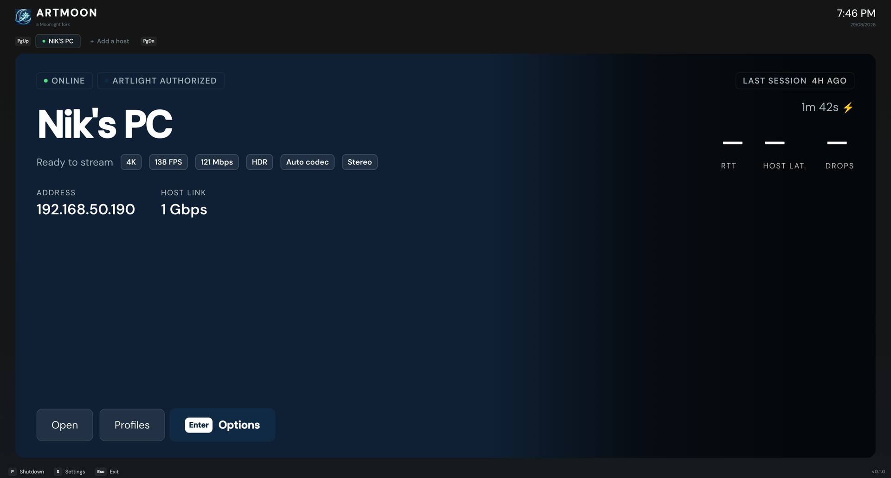
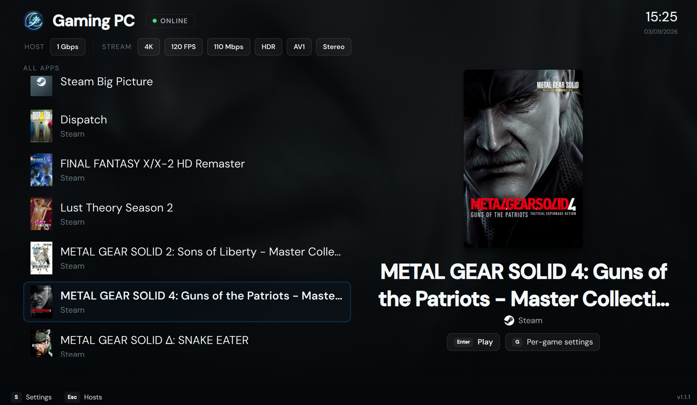
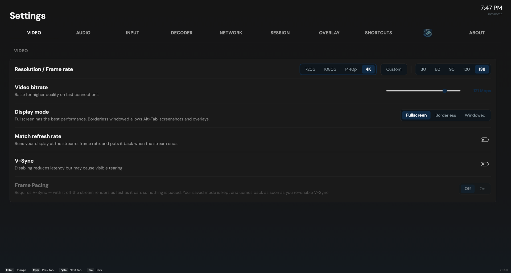

# 🌙 ArtMoon

<div align="center">
  
</div>

[](https://github.com/onaiaku/ArtMoon) [](https://www.qt.io/) [](https://github.com/moonlight-stream/moonlight-qt) [](https://www.gnu.org/licenses/gpl-3.0)

<div align="center">
  
</div>

**ArtMoon** is a gamepad-first streaming client built on [Moonlight](https://github.com/moonlight-stream/moonlight-qt), developed by **onaiaku & Rias**. It pairs with its host-side companion, [**ArtLight Control**](https://github.com/onaiaku/ArtLight), for a full sofa-to-host experience.

<div align="center">
  
</div>

## ✅ Compatibility

**Windows 10 and 11**, and **Linux** (AppImage). Works as an ordinary Moonlight-compatible client against any **Sunshine / Apollo / Vibeshine / Vibepollo** host, and unlocks its paired feature set when the host companion is running.

> 🔐 **The bridge is authenticated.** Every command ArtMoon sends is signed with its existing Moonlight identity certificate; the host approves each client once, via a 4-digit PIN shown on both screens. **Streaming never depends on it** — without approval you stream normally and simply lose the paired features. Each host card shows its state as a badge (AUTHORIZED / PENDING / DENIED).

> ⚠️ **Not affiliated with or endorsed by the Moonlight project.** ArtMoon is an independent fork. For upstream Moonlight support, use the [official client](https://github.com/moonlight-stream/moonlight-qt).

## 🔥 Features

**🆕 Native refresh-rate detection**
- The FPS selector reads what your display *actually supports* instead of a hardcoded 30/60/90/120 list — a 138 Hz monitor offers 138, a 144 Hz monitor offers 144
- The global selector asks the display the window is on; per-game and per-host overrides consider every connected display
- The classic presets stay in the list, merged with your display's real rates, sorted

<div align="center">
  
</div>

**🕹️ Gamepad-first, keyboard-equal**
- Every action is reachable from the pad: D-pad across host tabs, library, settings tabs and dialogs, with a clickable prompt bar along the bottom
- **Prompts follow the device in your hands** — touch the keyboard and each glyph becomes the key to press; pick the pad back up and they return to that controller's own icons (Xbox / PlayStation / Nintendo, auto-detected or forced)
- **Rebindable shortcuts** — every in-stream keyboard hotkey and all three controller combos, in *Settings → Shortcuts*

**🏠 Home and the host page**
- **Home** is your hosts as tabs under the wordmark, the selected one filling the screen: name, state, addresses, stream settings and actions at once
- **The host page** puts the library down the left at full height and the game in the spotlight beside it — cover, name, store, and the right verb (*Resume* or *Play*)
- **Per-host backgrounds** — a colour you pick or a picture of your own, with the card's gradient derived from it
- **Your accent colour** — five presets or any hex code. Status colours never follow it: online stays green, *Shutdown* red

**🎬 In-stream**
- **Performance overlay, built line by line** — eleven lines to choose from, switched on and off on the overlay itself
- **Stream Settings panel** — change resolution, frame rate, bitrate, HDR and frame pacing **while streaming**
- **Custom resolutions** — any width and height, not just the presets
- **Match refresh rate** — runs your display at the stream's frame rate for the session (Fullscreen), per-host overridable

**⚙️ Settings and profiles**
- Ten tabs, pill-style selectors, inline subtitles instead of tooltips
- **Per-host profiles** — up to three named profiles per host, each overriding resolution, frame rate, bitrate, HDR, codec, display mode, V-Sync, frame pacing, audio and more
- **Per-game overrides** on top of the active profile
- Every FPS list is built from what your display actually reports — no hardcoded presets where your hardware can speak for itself

## 🔗 Paired Features (with ArtLight Control)

These cross the bridge and need both apps. All switched on **per host**, in **Settings → StreamTweak** (the companion tab). Streaming itself is never affected either way.

- **Host link matching** — the client measures its wired link and asks the host to match it, fixing audio dropouts from speed-mismatched links
- **Seamless launch** — the stream window stays hidden until the game is really on screen
- **Remote PIN unlock** — wake the host and sign in with its Windows PIN from the sofa
- **Host session report** — grade, duration, RTT, frame latency, drop rate, covers of what was played
- **Host metrics in the overlay** — GPU, encoder, temps, VRAM, CPU, network
- **Store badges** — Steam, Epic, GOG, Ubisoft, Xbox, Battle.net, EA App
- **Session quality reporting** — grades and charts from per-second telemetry
- **Remote host power-off / Windows Update** — from the sofa
- **Tailscale in one tile** — one host, both addresses, automatic selection

## 🏗️ Architecture

A Qt 6 / QML fork of [Moonlight-Qt](https://github.com/moonlight-stream/moonlight-qt). The UI layer and the paired-feature bridge are ours.

```
ArtMoon (Qt, client PC)
    │  TCP port 47998
    ▼
ArtLight Control (host PC)  →  Named Pipe  →  ArtLightControlService (LocalSystem)
                                                           │
                                                           ▼
                                                NIC speed via CIM/WMI
                                                Host assets via filesystem
                                                Windows Update via WUA
```

## 📦 Installation

**Windows** — download the installer from the [**Releases page**](https://github.com/onaiaku/ArtMoon/releases/latest) and run it.

**Linux** — one line:

```bash
curl -fsSL https://raw.githubusercontent.com/onaiaku/ArtMoon/main/install.sh | bash
```

The script installs the AppImage to `/usr/local/bin`, adds a desktop entry, and doubles as the updater — run it again to update.

Settings — paired hosts, video / audio / input preferences, client certificate — live under `HKCU\Software\FoggyBytes\StreamLight` (a path inherited from the project's StreamLight origins; renaming it is planned alongside a settings migration), and box art is cached in `%LOCALAPPDATA%\FoggyBytes\StreamLight`.

## 🤝 Acknowledgements

- [**Moonlight**](https://github.com/moonlight-stream/moonlight-qt) — the open-source client this fork is built on; full credit to its contributors
- [**StreamTweak**](https://github.com/FoggyBytes/StreamTweak) by FoggyBytes — ArtLight Control, our host-side companion, is a fork of it
- [**Sunshine**](https://github.com/LizardByte/Sunshine) — the streaming host that started it all
- [**Apollo**](https://github.com/ClassicOldSong/Apollo) — community-driven Sunshine fork
- [**Vibeshine**](https://github.com/Nonary/vibeshine) and [**Vibepollo**](https://github.com/Nonary/Vibepollo) — fully supported hosts

## License
[](https://www.gnu.org/licenses/gpl-3.0)

ArtMoon is released under the GPL v3 License, in accordance with the upstream Moonlight license.
